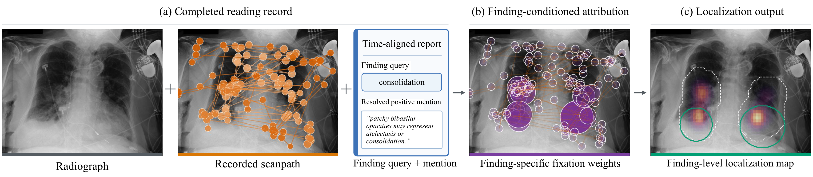
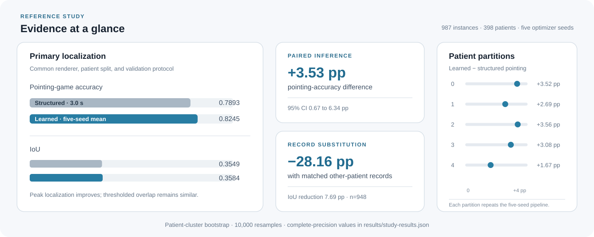
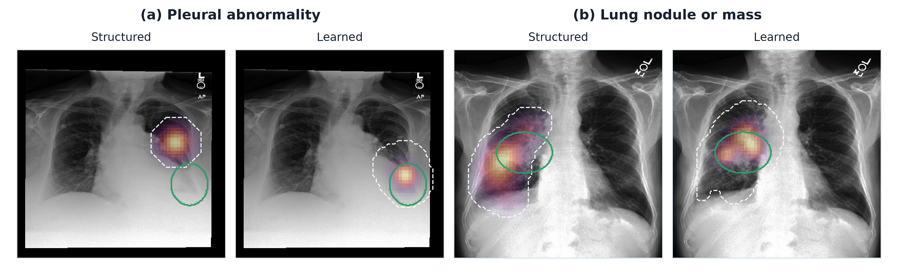

<div align="center">

# Finding-Level Gaze Targets

### Structured cues and learned reweighting for complete chest-radiograph scanpaths

**Sumin Lee\*** · **Hyunsu Go\*** · Subeen Lee · Kyeonghun Kim · Nam-Joon Kim<sup>†</sup>

Seoul National University · OUTTA

<sup>\*</sup>Equal contribution &nbsp;·&nbsp; <sup>†</sup>Corresponding author

[](https://github.com/gohyunsu/finding-level-gaze-targets/actions/workflows/ci.yml)
[](pyproject.toml)
[](results/study-results.json)
[](docs/REPRODUCIBILITY.md)

[Overview](#overview) · [Method](#method) · [Results](#results) · [Quick start](#quick-start) · [Reproduction](#reproducing-the-study) · [Citation](#citation)

</div>

<p align="center">
  
</p>

<p align="center"><strong>Figure 1.</strong> Finding-level gaze target construction from a complete REFLACX reading.</p>

A reported finding and indicators extracted from its linked positive mentions
are paired with the recorded scanpath. A structured or learned selector assigns
finding-specific weights to the fixations. The shared rendering pipeline
produces a continuous map and calibrated binary mask (white dashed contour),
evaluated against the annotated region (green contour). The radiograph is shown
for context; image pixels are not inputs to either selector. Training
annotations estimate the anatomical prior and fit the learned selector, while
test reference regions are reserved for evaluation.

## Overview

A radiology reading may report several findings while eye tracking supplies one
complete scanpath. This project resolves that mismatch by assigning
finding-conditioned weights to the observed fixations and rendering a separate,
continuous localization target for every linked finding.

The reference study compares transparent structured cues with a compact learned
selector under the same renderer, calibration, patient split, and evaluation
protocol. The selector never receives radiograph pixels; its role is to identify
which fixations in the recorded reading are most relevant to the target finding.

| Finding-level output | Controlled comparison | Reproducible evidence |
|---|---|---|
| Separate target maps from a shared scanpath | Structured and learned selectors share downstream processing | Frozen study configuration, machine-readable results, tests, and CI |
| Mention-linked temporal context | Patient-level splits and clustered inference | Five optimizer seeds and five patient partitions remain distinct |
| Continuous 64×64 localization maps | Validation-selected calibration and lookback | Public, identifier-free aggregate registry |

## Method

### 1. Link findings to the reading

Positive report mentions are resolved to finding labels and sentence timing.
The aligned record retains fixation position, timing, duration, and motion
features. Longer temporal windows are reconstructed from sentence boundaries
and verified against the cached 1.5-second window.

### 2. Reweight the complete scanpath

Two selector families operate on the same aligned record:

- **Structured selector:** combines a training-derived anatomical prior,
  target-record scanpath support, a linked-mention temporal gate, and directional
  terms such as left/right and upper/lower.
- **Learned selector:** uses one scaled dot-product attention layer. The query
  combines finding identity and mention indicators; fixation keys combine
  temporal, kinematic, and Fourier-encoded position features.

### 3. Render and calibrate the target

Both selectors produce weights over the original fixations. A shared renderer
converts those weights into a 64×64 map, and all calibration decisions are made
on validation data. This isolates the contribution of fixation selection from
the effects of rendering or post-processing.

Implementation-to-result mappings are documented in
[`docs/RESULTS.md`](docs/RESULTS.md).

## Results

<p align="center">
  
</p>

<p align="center"><em>All displayed values are generated from the released aggregate registry.</em></p>

The primary test cohort contains **987 mention-linked finding instances from
398 patients**. Learned metrics first average optimizer seeds 0–4 within each
test instance; inference then resamples patients while retaining all instances
belonging to each patient.

Three results define the main readout:

1. The learned selector reaches **0.8245 pointing accuracy**, compared with
   **0.7893** for the validation-selected 3.0-second structured selector.
2. The paired pointing-accuracy difference is **+0.0353** (95% CI
   0.0067–0.0634); the IoU difference is **+0.0035** (95% CI
   −0.0034–0.0102), indicating similar thresholded spatial overlap.
3. Substituting exact-matched records from other patients reduces pointing
   accuracy by **0.2816** and IoU by **0.0769** across 948 eligible instances,
   showing that matched labels and indicators do not reproduce the paired record.

### Qualitative comparison

<p align="center">
  
</p>

<p align="center"><strong>Figure 2.</strong> Examples from the primary comparison: (a) pleural abnormality and (b) lung nodule or mass.</p>

In both cases, the validation-selected 3.0-second structured map peaks outside
the reference region, whereas the mean learned map peaks inside. Structured and
five-seed mean learned IoU are 0.006 and 0.386 in (a), and 0.222 and 0.272 in
(b). Purple–yellow denotes continuous map intensity, green contours mark the
reference regions, and white dashed contours show the calibrated structured
mask or the learned majority-vote mask across five seed-specific calibrated
masks. Learned maps are averaged across the five seeds.

<details>
<summary><strong>Complete numerical tables</strong></summary>

### Primary comparison

| Method | Pointing accuracy | IoU |
|---|---:|---:|
| Validation-selected 3.0-s structured selector | 0.7893 | 0.3549 |
| Ten-indicator learned selector, five-seed mean | **0.8245** | **0.3584** |

### Feature and record controls

| Condition | Pointing accuracy | IoU |
|---|---:|---:|
| Ten-indicator selector | 0.8245 | 0.3584 |
| Four-indicator selector | **0.8373** | 0.3574 |
| Finding + temporal/kinematic only | 0.7295 | 0.3135 |
| Positional features permuted | 0.5534 | 0.2306 |
| Temporal/kinematic features permuted | 0.6833 | 0.2976 |
| Spatial indicators masked | 0.7495 | 0.3068 |

### Training-size sensitivity

| Training fraction | Learned pointing | Structured pointing | Learned IoU | Structured IoU |
|---:|---:|---:|---:|---:|
| 10% | 0.7677 | 0.7781 | 0.3191 | 0.3457 |
| 25% | 0.8026 | 0.7901 | 0.3354 | 0.3518 |
| 50% | 0.8190 | 0.7895 | 0.3415 | 0.3535 |
| 100% | 0.8245 | 0.7893 | 0.3583 | 0.3549 |

Across five patient partitions, the learned selector's pointing-accuracy gain
ranges from 0.0167 to 0.0356. Complete-precision values and estimator metadata
are available in [`results/study-results.json`](results/study-results.json).

</details>

## Study design

| Component | Specification |
|---|---|
| Dataset | REFLACX 1.0.0 on MIMIC-CXR 2.0.0 |
| Mention-linked split | 1,895 train / 547 validation / 987 test |
| Split and resampling unit | Patient |
| Primary test patients | 398 |
| Optimizer seeds | 0, 1, 2, 3, 4 |
| Bootstrap | 10,000 patient-cluster resamples |
| Metrics | Pointing-game accuracy and IoU |
| Structured lookback | Validation-selected from 0.5–3.0 seconds |

Optimizer-seed variation, patient-partition variation, and patient-subsample
variation are retained as separate axes. The training-size analysis averages
five optimizer seeds within each of five nested patient-subsample chains.

## Quick start

The public result contract and README figures can be checked without access to
clinical data:

```bash
git clone https://github.com/gohyunsu/finding-level-gaze-targets.git
cd finding-level-gaze-targets
python -m venv .venv
source .venv/bin/activate
python -m pip install --upgrade pip
python -m pip install -e '.[dev]'

python verify_results.py
python scripts/render_readme_assets.py --check
pytest -q
```

Inspect the released registry from the command line:

```bash
finding-level-gaze-results --summary
```

## Reproducing the study

Credentialed access to REFLACX and MIMIC-CXR is required for model reruns.
Keep source data and generated artifacts outside the repository.

```bash
# Build the aligned scanpath/mention cache
python -m finding_level_gaze_targets.maps.core \
  /path/to/reflacx --cache /work/cache/align.pt

# Reconstruct structured rows and select the temporal lookback
python scripts/run_analysis.py structured-comparison \
  --cache /work/cache/align.pt --raw-root /path/to/reflacx

# Run the five-seed primary comparison and paired inference
python scripts/run_analysis.py primary \
  --cache /work/cache/align.pt --raw-root /path/to/reflacx \
  --epochs 40 --seeds 0,1,2,3,4 --split-seed 0
```

The [reproduction guide](docs/REPRODUCIBILITY.md) provides the complete command
matrix for architecture selection, patient partitions, feature controls,
record substitution, and training-size sensitivity.

## Repository structure

```text
.
├── assets/                         paper figures and generated result overview
├── configs/study.json              frozen study definition
├── docs/                            result and reproduction guides
├── results/study-results.json      machine-readable reported values
├── scripts/                         analysis and figure entry points
├── src/finding_level_gaze_targets/ reusable implementation
├── tests/                           data-free contract tests
└── verify_results.py               independent release validator
```

## Data boundary

REFLACX 1.0.0 and MIMIC-CXR 2.0.0 are distributed through PhysioNet under
credentialed access. The repository includes the two de-identified, overlaid
figures shown in the paper, but does not distribute the complete manuscript PDF,
source radiographs, source reports, patient identifiers, patient-level
predictions, derived caches, or checkpoints.

## Citation

```bibtex
@inproceedings{lee2026finding,
  title     = {From Complete Scanpaths to Finding-Level Gaze Targets in Chest Radiography: Structured Cues and Learned Reweighting},
  author    = {Lee, Sumin and Go, Hyunsu and Lee, Subeen and Kim, Kyeonghun and Kim, Nam-Joon},
  booktitle = {IEEE MedAI},
  year      = {2026}
}
```

Machine-readable citation metadata are provided in
[`CITATION.cff`](CITATION.cff).
