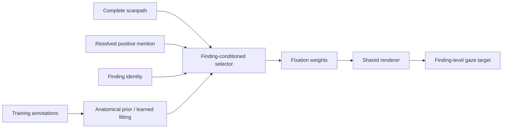

<div align="center">

# Finding-Level Gaze Targets

### Structured cues and learned reweighting for complete chest-radiograph scanpaths

**Sumin Lee\*** · **Hyunsu Go\*** · Subeen Lee · Kyeonghun Kim · Nam-Joon Kim<sup>†</sup>

Seoul National University · OUTTA

<sup>\*</sup>Equal contribution &nbsp;·&nbsp; <sup>†</sup>Corresponding author

[](https://github.com/gohyunsu/finding-level-gaze-targets/actions/workflows/ci.yml)
[](pyproject.toml)
[](results/study-results.json)

[Overview](#overview) · [Method](#method) · [Results](#results) · [Reproduce](#reproduction) · [Data](#data-boundary) · [Citation](#citation)

</div>

---

## Overview

A complete radiology reading can contain several reported findings but only one
recorded scanpath. This project constructs a separate localization target for
each finding by assigning finding-conditioned weights to the observed fixations
and rendering them as a continuous map.

Structured and learned selectors are compared under the same rendering,
calibration, patient split, and evaluation protocol. Neither selector receives
radiograph pixels. The released implementation covers the primary five-seed
comparison, structured baselines, temporal-window selection, feature controls,
matched-record substitution, training-size sensitivity, and patient-partition
sensitivity reported in the associated IEEE MedAI 2026 study.

<p align="center">
  
</p>

## Method



The structured selector combines four cues:

- a finding-specific anatomical prior estimated from training annotations;
- support from fixations in the target reading;
- a linked-mention temporal gate; and
- directional terms such as left/right and upper/lower.

The learned selector uses a single scaled dot-product attention layer. Its query
combines the finding identity and ten mention indicators; each fixation key uses
continuous temporal and kinematic features plus Fourier-encoded position. Both
selectors produce weights over the original scanpath, followed by the same
64×64 rendering and validation-selected calibration.

See [Method and results](docs/RESULTS.md) for the estimator and analysis mapping.

## Results

The primary test cohort contains **987 mention-linked finding instances from
398 patients**. Learned metrics average optimizer seeds 0–4 within each test
instance before patient-cluster inference.

### Primary comparison

| Method | Pointing accuracy | IoU |
|---|---:|---:|
| Validation-selected 3.0-s structured selector | 0.7893 | 0.3549 |
| Ten-indicator learned selector, five-seed mean | **0.8245** | **0.3584** |

The learned-minus-structured difference is **+0.0353** for pointing accuracy
(95% CI 0.0067–0.0634) and **+0.0035** for IoU (95% CI −0.0034–0.0102).
The evidence supports a modest improvement in peak localization; thresholded
spatial overlap is similar.

### Feature and record controls

| Condition | Pointing accuracy | IoU |
|---|---:|---:|
| Ten-indicator selector | 0.8245 | 0.3584 |
| Four-indicator selector | **0.8373** | 0.3574 |
| Finding + temporal/kinematic only | 0.7295 | 0.3135 |
| Positional features permuted | 0.5534 | 0.2306 |
| Temporal/kinematic features permuted | 0.6833 | 0.2976 |
| Spatial indicators masked | 0.7495 | 0.3068 |

Replacing a target record with exact-matched records from other patients lowers
pointing accuracy by 0.2816 and IoU by 0.0769 on 948 eligible instances. This
control tests whether finding and spatial-indicator matching can reproduce the
paired record; it does not isolate a single causal component.

### Training-size sensitivity

| Training fraction | Learned pointing | Structured pointing | Learned IoU | Structured IoU |
|---:|---:|---:|---:|---:|
| 10% | 0.7677 | 0.7781 | 0.3191 | 0.3457 |
| 25% | 0.8026 | 0.7901 | 0.3354 | 0.3518 |
| 50% | 0.8190 | 0.7895 | 0.3415 | 0.3535 |
| 100% | 0.8245 | 0.7893 | 0.3583 | 0.3549 |

Across five patient partitions, the learned selector's pointing-accuracy gain
ranges from 0.0167 to 0.0356. Complete-precision values and estimator metadata
are stored in [`results/study-results.json`](results/study-results.json).

## Experimental design

| Component | Specification |
|---|---|
| Dataset | REFLACX Phase 3 on MIMIC-CXR |
| Mention-linked split | 1,895 train / 547 validation / 987 test |
| Split and resampling unit | Patient |
| Primary test patients | 398 |
| Optimizer seeds | 0, 1, 2, 3, 4 |
| Bootstrap | 10,000 patient-cluster resamples |
| Metrics | Pointing-game accuracy and IoU |
| Structured lookback | Validation-selected from 0.5–3.0 s |

Optimizer-seed variation, patient-partition variation, and patient-subsample
variation are retained as separate axes. The training-size analysis averages
five optimizer seeds within each of five nested patient-subsample chains.

## Reproduction

### Install and run data-free checks

```bash
git clone https://github.com/gohyunsu/finding-level-gaze-targets.git
cd finding-level-gaze-targets
python -m venv .venv
source .venv/bin/activate
python -m pip install --upgrade pip
python -m pip install -e '.[dev]'

python verify_results.py
python scripts/render_readme_assets.py --check
pytest -q
```

### Run analyses from credentialed data

```bash
# Build the aligned scanpath/mention cache
python -m finding_level_gaze_targets.maps.core \
  /path/to/reflacx --cache /work/cache/align.pt

# Reconstruct structured rows and select the temporal lookback
python scripts/run_analysis.py structured-comparison \
  --cache /work/cache/align.pt --raw-root /path/to/reflacx

# Five-seed primary comparison and paired inference
python scripts/run_analysis.py primary \
  --cache /work/cache/align.pt --raw-root /path/to/reflacx \
  --epochs 40 --seeds 0,1,2,3,4 --split-seed 0
```

The [reproduction guide](docs/REPRODUCIBILITY.md) documents the remaining
controls, partition runs, and strict aggregation layout.

## Repository map

```text
.
├── assets/                         README result visualization
├── configs/study.json              frozen study definition
├── docs/                            result and reproduction guides
├── results/study-results.json      machine-readable reported values
├── scripts/                         analysis and asset entry points
├── src/finding_level_gaze_targets/ reusable implementation
├── tests/                           data-free contract tests
└── verify_results.py               independent result validator
```

## Data boundary

REFLACX 1.0.0 and MIMIC-CXR 2.0.0 are available through PhysioNet under
credentialed access. This repository contains no radiographs, reports, patient
identifiers, patient-level predictions, derived data caches, model checkpoints,
or manuscript PDF. The qualitative radiographs used in the paper are also not
redistributed here.

## Citation

```bibtex
@inproceedings{lee2026finding,
  title     = {From Complete Scanpaths to Finding-Level Gaze Targets in Chest Radiography: Structured Cues and Learned Reweighting},
  author    = {Lee, Sumin and Go, Hyunsu and Lee, Subeen and Kim, Kyeonghun and Kim, Nam-Joon},
  booktitle = {IEEE MedAI},
  year      = {2026}
}
```

Machine-readable metadata are provided in [`CITATION.cff`](CITATION.cff).
